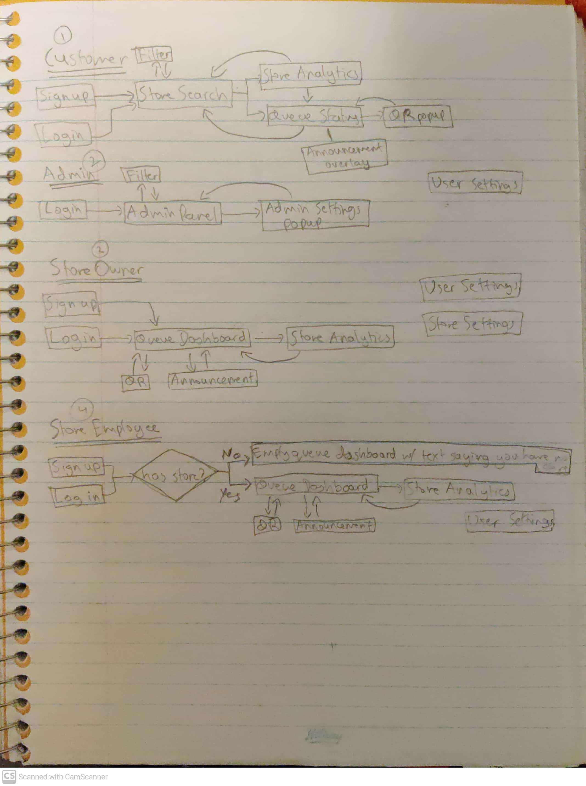

This application is a virtual Queue Management system.

## Users

The image below shows a brief overview of each user's flow through the application.

Below are details about the various classes of users and their functionality. We have 4 classes of users: visitor, owner, employee, admin.

### Visitor user

Username: `user`, password: `user`

On signing up/logging in, you will be redirected to the store searching page. Here you can search for stores using the search function, the filtering, or by navigating the map and clicking on a marker. Note that the black marker represents your location, and the other markers represent store locations. Once you have selected a store, you can click on Join Queue to join the queue, or View Data to view analytics about the store. You can also favorite a store by clicking on the star button to later be able to filter only your favorited stores. You will also see a check mark on the top right of the store card if the store has been officially verified by our administration team. If you clicked on View Data, you will now see analytics information about the store. You can either go back to store search by clicking on Back or decide to Join Queue. Clicking Join Queue here amounts to the same as clicking it on store search. Joining the queue takes you to the queue status page. Here you can view information about your status in the queue such as your predicted waiting time to reach the front of the queue, number of people in the queue/store, and a small visualization of your position in the queue. We also have a map preview of where you are and where the store is in case you're not currently at the store. You'll see an announcement show up if the queue managers need to inform you of anything. When the managers want you to call you to the store, you'll be notified by a message from the store. When you're called to the store, you must then click display QR to show your QR code to the manager. You can also click exit queue to exit the queue at any time.

### Owner user

Username: `user1`, password: `user1`

When you sign up as a store owner you will be given default credentials for your store. you must visit the settings page to customize it. You can customize the name, address, opening/closing time, and the list of employees. Once logging in/signing up, you will be redirected to the queue dashboard page where you can view information about the queue for your store and some quick stats about the store. Note that you must click on Activate Queue before users can start joining your queue. You must Deactivate Queue to disallow this. You can go to your store's analytics at any point by clicking on store analytics. You also have various controls over your store such as emptying its queue, marking a customer as exited, etc. You will see two lists of users, the first one shows you only one visitor, the visitor you most recently accepted so you may undo any mistaken clicks, and a list of currently waiting visitors in the queue. You can at any time choose to announce something to all users by using the Send Announcement button. You have various controls for the users in the waiting queue. You can reject any user in the queue or choose to notify them that they must present themselves soon. Once notified, you may choose to accept them which brings up a QR code reader to read the visitor's QR code. If the QR code was valid, a green message saying so will pop up. If not, a red message saying so will pop up. You can choose to let the user inside or reject the user from the QR popup.

### Employee user

Username: `user2`, password: `user2`

When you sign up/log in as an employee, you will be redirected to your store's queue dashboard. A notification may pop up saying you have no store set to your account. If this is the case you must ask your store's owner to add your username to their employee list in their account. Once that's done you will be able to view the store's dashboard. The rest of the flow from here is the same as the owner user. The only difference is that you may not view/edit the store's settings.

### Admin user

Username: `admin`, password: `admin`

When you log in as an admin, you will see the admin panel page. Here you can search for users, stores using the filter functionality and edit a user/store at any point. You can also verify a store which lets users know that this store has been officially verified by our administration team. This brings up a popup where you will have to make your changes and then save them.

## What we've mocked

## Routes Overview

Below are a list of all the back-end API routes we've made for the application.

- `POST` - `/login`
  Requires JSON body with username and password.
  Logs the user corresponding to username and password if it's valid, and creates a session.

- `GET` - `/logout`
  Destroys the current session.

- `GET` - `/check-session`
  Checks if a session exists, returns it if exists.

- `POST` - `/newCustomer`
  Requires JSON body with password, email, username, phone_number all strings. Creates a new user of type visitor. Returns the user's ID.

- `POST` - `/newOwner`
  Requires JSON body with password, email, username, phone_number all strings. Creates a new user of type owner. Returns the user's ID.

* `POST` - `/newEmployee`
  Requires JSON body with password, email, username, phone_number all strings. Creates a new user of type employee. Returns the user's ID.

* `POST` - `/newAdmin`
  Requires JSON body with password, email, username, phone_number all strings. Creates a new user of type admin. Returns the user's ID.

* `POST` - `/newStore`
  Requires JSON body with name (string), address (string), verified (bool), owner_id (string), open_time (string), close_time (string) where the two times are dates formatted with date-and-time using the format: "hh:mm:ss A". Creates a new store, sets the owner_id user's store_id to be the created store. Returns the newly created store.

* `GET` - `/getDistance`
  Requires number query paramters: fromLat, fromLong, toLat, toLong, returns the distance between the two coordinates (fromLat, fromLong) and (toLat, toLong). Returns the distance in an object with key dist.

* `GET` - `/getAllStores`
  Returns an array of all the stores.

* `GET` - `/getAllUsers`
  Returns an array of all the users.

- `GET` - `/getUserById`
  Takes in the user_id as a query parameter and returns the user that corresponds to that ID if exists.

- `GET` - `/getUserFavStores`
  Returns an array of the stores the logged in user has favorited.

- `POST` - `/updateUserFavStores`
  Takes in a store_id (string) and bool (string) as query parameters and adds the store from the logged in user's favorited list of bool is true and removes it if it's false. Returns an array of the updated favorited stores.

- `GET` - `/getStoreById`
  Takes in store_id as a query parameter, returns the corresponding store if exists

* `GET` - `/getUserStore`
  Returns an object containing the logged in user's user object and store if exists.

* `POST` - `/joinQueue`
  Takes in a store_id (string), entry_time (string), exit_time (string) as JSON body where the two times are date-and-time formatted using "MMM D YYYY hh:mm:ss A". Creates a new event object representing the logged in user joining the queue. Returns the newly created event.

- `POST` - `/updateEvent`
  Takes in the event object as JSON body, and updates the event corresponding to the ID provided to be the provided event object. Event objects have store_id (string), user_id (string), username (string), entry_time (string), exit_time (string), accepted (boolean), notified (boolean).

- `POST` - `/exitQueue`
  Takes in the event object as JSON body and marks it as having exited the queue by updating the exit_time. Event objects have store_id (string), user_id (string), username (string), entry_time (string), exit_time (string), accepted (boolean), notified (boolean).

* `GET` - `/getEventsByStoreId`
  Takes in the store_id as a query parameter, and returns an array of all the events for that store.

* `PATCH` - `/updateUser`
  Takes in a JSON body of all the fields to update, and updates the current user accordingly. Encrypts passwords.

* `PATCH` - `/updateStore`
  Takes in a JSON body of the store to update and updates the store corresponding to store_id in the query parameters.

* `GET` - `/getCurrentUser`
  Returns the currently logged in user's user object.

* `GET` - `/getStoreIdFromJoinedQueue`
  Gets the currently logged in user's event object and sends the store ID corresponding to the event.

* `GET` - `/getUserId`
  Gets the currently logged in user's user ID.

* `DELETE` - `/deleteUser`
  Deletes the currently logged in user.

* `GET` - `/checkValidEmployee`
  Takes in a username (string) as query parameter and returns { valid: "incorrect" } if it's an invalid user and { valid: "correct" } if it's a valid user.
